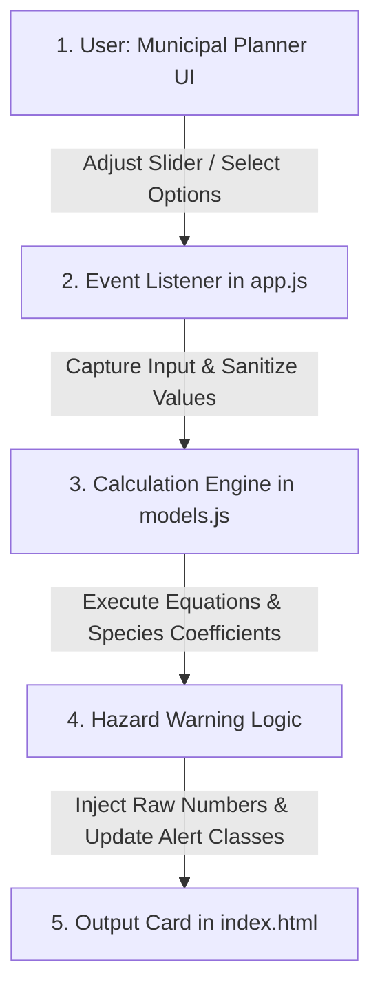

# Plan of Work: Addressing Biomonitoring Research Gaps with Advanced Analytical Tools

This document defines a comprehensive, mathematically rigorous plan of work designed to identify, address, and bridge critical research gaps in the literature of foliar particulate matter (PM) accumulation and persistent organic pollutant (POP) biomonitoring. Specifically, it details the engineering, mathematical formulations, software architectures, and verification protocols for three newly developed analytical tools designed to translate qualitative field data into predictive environmental models, alongside five advanced computational tools extending these concepts to cross-industry applications.

---

## 1. Identified Research Gaps in the Literature

### 1.1. Gap 1: Methodological Standardization in Leaf Area and Deposition Normalization

* **The Scientific Problem:** The methodologies deployed to isolate, quantify, and normalize PM deposition on foliar surfaces are fragmented. Studies historically express dust deposition in divergent metrics—either normalizing gravimetric dust masses against dry leaf weight ($mg/g$), leaf projected area ($mg/cm^2$ from single-sided scans), or bilateral leaf surface area ($mg/cm^2$ accounting for both adaxial and abaxial surfaces). For instance, the foundational study by [Sæbø et al. (2012)](https://doi.org/10.1016/j.scitotenv.2012.03.084) clusters species performance based on projected area without standardizing the spatial partition of particles. Similarly, [Dzierżanowski et al. (2011)](https://doi.org/10.1080/15226514.2011.552929) establish the analytical split between Surface Particulate Matter (SPM) and Wax-embedded Particulate Matter (WPM), but do not provide a standardized geometric normalizer for researchers to calculate size-fractionated loads.
* **Limitations of Existing Models:** As highlighted by [Moura et al. (2024)](https://doi.org/10.3390/urbansci8030125) and [Xu et al. (2018)](https://doi.org/10.1007/s11356-018-1478-4), comparisons across species with vastly different shapes (such as planar broadleaves versus acicular pine needles) are inaccurate when using standard scanners. There is a lack of an open-access geometric engine to normalize multi-lateral dimensions and filtration weights into SPM/WPM size fractions, and no standardized mechanism to compute a Rain Vulnerability Factor (RVF) to predict how much surface dust is shed during precipitation events of varying intensities.
* **The Solution:** The **Leaf Area & Particulate Deposition Normalizer (LAPDN)**, implemented in [LeafNormalizer](file:///d:/PROJECT/ddos/models.js#L11). This tool standardizes leaf area calculations across five distinct morphologies (planar, lanceolate, elliptic, obovate, acicular) using empirical correction factors ($CF_{morph}$) and automatically normalizes filter tare and final gravimetric weights. It divides total dust mass by $2 \times A$ to enforce bilateral normalization (accounting for both top/adaxial and bottom/abaxial leaf surfaces) and models non-linear rainfall-induced SPM wash-off dynamics.

### 1.2. Gap 2: Foliar Dust Stress & Species Physiological Resilience Modeling

* **The Scientific Problem:** Classical air quality plans treat street trees and urban green infrastructure as passive, indestructible physical filters. However, leaves are active biological organs with strict physiological thresholds. High foliar dust accumulation blocks stomatal pores, degrades epicuticular waxes, and forms a physical crust that screens solar radiation, suppressing photosynthesis and transpiration. [Munam et al. (2025)](https://doi.org/10.7717/peerj.20121) and [Chaturvedi et al. (2013)](https://doi.org/10.1007/s10661-012-2560-x) document that heavy dust loads along highly polluted transport corridors induce significant chlorophyll degradation, stomatal clogging, and cell damage.
* **Limitations of Existing Models:** While these papers quantify stress markers in specific field campaigns, they do not provide a generalized mathematical framework. There is no existing mathematical engine that takes daily dust loading ($mg/cm^2$) and dry days since the last rain event, and models the combined kinetics of chlorophyll decay, stomatal clogging, and net photosynthetic reduction across different species. Consequently, municipal planners cannot predict when a bio-filtration canopy will undergo physiological collapse.
* **The Solution:** The **Foliar Dust Stress & Photosynthetic Resilience Predictor (FDSPRP)**, implemented in [ResiliencePredictor](file:///d:/PROJECT/ddos/models.js#L95). A kinetic stress engine that integrates species-specific sensitivity constants ($k_{chl}$) and stomatal clogging coefficients ($b$) to model chlorophyll retention, stomatal conductance reduction, and net photosynthetic suppression as a function of cumulative dust loads and rain-free intervals. It issues automated management alerts to trigger street-washing or irrigation when a species nears "Critical Physiological Collapse."

### 1.3. Gap 3: Organic Pollutant Leaching & Decay Kinetics of Leaf Litter

* **The Scientific Problem:** Urban canopies and roadside forest compartments are primary sinks for airborne persistent organic pollutants (POPs), including polycyclic aromatic hydrocarbons (PAHs) and polychlorinated biphenyls (PCBs). In historically contaminated areas, these lipophilic chemicals partition strongly into the cuticular waxes of leaves. Over seasonal cycles, these leaves fall, forming a dense organic litter layer. [Nechita et al. (2026)](https://doi.org/10.1007/s10653-026-03093-z) demonstrate that forest litter acts as a major reservoir of these carcinogens, accumulating toxic equivalencies (TEQ) up to $71.55\text{ ng/g}$ in formerly mining areas.
* **Limitations of Existing Models:** Over time, leaf litter decomposes, and the bound organic toxins leach into local soils and groundwater tables. Municipalities often pile or leave fallen leaves along streets, unaware of the chemical leaching hazard. To date, there is no kinetic model that simulates organic mass decay alongside chemical desorption rates as a function of temperature, precipitation, species-specific lignin-to-nitrogen ratios (Lignin:N), and chemical octanol-water partition coefficients ($\log K_{ow}$), which dictate compound mobility, as discussed by [Xue et al. (2026)](https://doi.org/10.1016/j.envpol.2026.127675).
* **The Solution:** The **Leaf Litter Decomposition & Toxin Leaching Simulator (LLDTLS)**, implemented in [LitterLeacher](file:///d:/PROJECT/ddos/models.js#L161). A coupled thermodynamic and mass-balance simulator that models monthly organic mass decay via a modified Olsen exponential model and simulates compound-specific leaching fractions (LMW PAHs, HMW PAHs, PCBs). It calculates the cumulative Toxic Equivalency (TEQ) of the resulting water runoff and triggers hazardous warnings when runoff toxicity crosses critical regulatory thresholds.

---

### 1.4. Comprehensive Analysis of Unaddressed Gaps in Foliar Biomonitoring Literature

Despite the expanding implementation of terrestrial vegetation as a passive matrix for atmospheric pollution monitoring and abatement, a critical examination of current literature exposes persistent methodological, structural, and computational vulnerabilities. The foundational paradigms governing this field frequently oversimplify the leaf-atmosphere boundary layer by evaluating variables under isolated, static conditions. This conceptual reductionism fails to resolve the multi-phasic, non-linear dynamics characterizing urban and industrial ecosystems. The remaining scientific deficiencies span fluid mechanics, membrane thermodynamics, multi-omics molecular botany, and inverse mathematical modelling.

#### 1.4.1. Aerodynamic Interception and Boundary Layer Kinetics

Current foliar deposition and extraction frameworks are built almost exclusively around spherical, inorganic particulate matter and associated trace metals, leaving a significant mechanistic void regarding non-spherical anthropogenic variants. High-aspect-ratio microfibers—such as synthetic filaments and tire-wear micro-rubbers—do not conform to standard Newtonian gravitational settling or Brownian diffusion profiles. Instead, their irregular geometries cause them to align dynamically with localized wind shear vectors along the leaf edge. Furthermore, current transport models fail to capture the physics of sub-micron nanoplastic fragments, specifically whether these particles can dissolve into or swell the lipophilic cuticular wax matrix, facilitating direct translocation into the leaf mesophyll ([Gaglione et al., 2026](https://doi.org/10.7717/peerj.20558)).

This predictive inaccuracy is exacerbated by systemic inconsistencies in how particle accumulation is normalized across disparate plant functional groups. The structural divergence between planar deciduous broadleaves and acicular coniferous evergreens introduces substantial mathematical bias when data is parsed using simple two-dimensional metrics. Relying strictly on Specific Leaf Area (SLA) via planar scans fails to resolve the complex 3D surface geometries of pine needles, while normalizing pollutant mass against Leaf Dry Matter Content (LDMC) artificially downplays the filtration capacity of dense, heavy acicular structures ([Sæbø et al., 2012](https://doi.org/10.1016/j.scitotenv.2012.03.084)).

Compounding these structural classification errors is the prevalent assumption that plant canopies function as terminal, unidirectional pollution sinks. In reality, foliar surfaces exist in a continuous state of kinetic resuspension and re-entrainment. During high-velocity wind events, the aerodynamic lift and drag forces exerted on accumulated crusts frequently overcome the stabilizing van der Waals and surface tension interactions. The field currently lacks kinetic models capable of evaluating how variations in leaf micro-topography—such as trichome density, epidermal ribbing, and sunken stomatal cavities—shelter captured particles from being re-released into the atmospheric boundary layer ([Hwang et al., 2011](https://doi.org/10.1016/j.atmosenv.2011.09.015)).

#### 1.4.2. Thermochemical Partitioning and Sub-Cellular Omics Pathways

On a chemical scale, evaluating the capture of persistent organic pollutants is severely limited by treating the epicuticular wax layer as a generic, homogenous lipophilic sponge. This perspective ignores the thermodynamic realities of compound-specific partitioning coefficients. The absolute absorption capacity ($\log K_{ow}$ equivalents) of the cuticle is governed directly by its micro-chemical profile—specifically the precise ratio of long-chain alkanes and alkyl esters to primary alcohols and free fatty acids. Waxes dominated by specific chemical classes exhibit highly selective affinities for distinct low-molecular-weight organic toxins, meaning that omitting species-specific thermodynamic profiling yields highly inaccurate canopy mass-balance estimations ([Dzierżanowski et al., 2011](https://doi.org/10.1080/15226514.2011.552929)).

Once these organic compounds partition into the cuticle, their environmental persistence is routinely modelled as a static timeline terminating at autumnal leaf senescence. This baseline completely overlooks the biological clearance pathways driven by specialized microbial communities inhabiting the phyllosphere. Diverse epiphyllous bacterial and fungal taxa actively secrete extracellular enzymes, such as laccases and peroxidases, which break down polycyclic aromatic hydrocarbons and volatile organic compounds directly upon interception. Excluding these micro-scale biodegradation kinetics from environmental transport equations results in a significant overestimation of the residual toxic load transferred to urban soils via litterfall leaching ([Waight et al., 2010](https://doi.org/10.1007/s00248-009-9631-8)).

When pollutants escape surface degradation and penetrate the interior tissue, the plant’s internal physiological response remains largely unmapped at the sub-cellular level. Biomonitoring frameworks traditionally rely on downstream, macroscopic endpoints like total chlorophyll degradation, carotenoid loss, or diminished stomatal conductance to infer atmospheric stress. Because these metrics represent late-stage physiological collapse, they fail to reveal the early-stage, upstream intracellular defence responses. Resolving these defence mechanisms requires multi-omics profiling—specifically transcriptomic sequencing (RNA-Seq) and high-resolution proteomic mapping—to identify the precise gene upregulation pathways, metallothionein expressions, and intracellular metabolomic shifts that dictate species-specific tolerance to heavy industrial loading ([Munam et al., 2025](https://doi.org/10.7717/peerj.20121)).

#### 1.4.3. Synergistic Stress Matrices and Localized Atmospheric Feedbacks

The predictive capability of greenbelt models remains severely constrained by the experimental isolation of physical and chemical stressors. In complex industrial and vehicular corridors, urban vegetation is exposed to these factors simultaneously, creating non-linear synergistic damage loops. Heavy metal ions embedded within the accumulated foliar dust act as inorganic catalysts under solar radiation, driving localized photo-oxidation reactions that accelerate the chemical breakdown of the protective epicuticular wax. This structural degradation of the cuticle subsequently lowers the physical barrier to penetration, allowing water-soluble toxins and fine dust particles to flood into the mesophyll tissue. Current literature lacks dual-stress mathematical formulations capable of capturing this mutual acceleration of physical and chemical degradation ([Munam et al., 2025](https://doi.org/10.7717/peerj.20121)).

This localized degradation fundamentally alters the vegetation's role in the wider atmospheric ecosystem. Rather than acting as passive filters, heavily crusted and heat-stressed plant canopies can actively worsen local air quality. Severe dust loading blocks normal gas exchange and drives up internal leaf temperatures, triggering a survival response characterized by the massive synthesis and emission of Biogenic Volatile Organic Compounds (BVOCs). In urban corridors, these stress-induced biogenic gaseous emissions rapidly react with vehicular $NO_x$ under sunlight. This interaction drives a positive feedback loop that accelerates the formation of ground-level ozone ($O_3$) and Secondary Organic Aerosols (SOA), directly increasing the ambient fine particulate concentration the greenbelt was intended to mitigate ([Xue et al., 2026](https://doi.org/10.1016/j.envpol.2026.127675)).

These interactions are further warped by shifting micro-meteorological baselines driven by global climate change and the intensification of the Urban Heat Island (UHI) effect. Elevated ambient temperatures within concrete urban canyons alter the physical viscosity of epicuticular waxes, making them more fluid and increasing the rate at which lipophilic compounds are absorbed and embedded into the leaf tissue. Furthermore, shifting precipitation profiles—marked by extended dry spells punctuated by short, intense downpours—disrupt historical wash-off models. Prolonged dry periods lead to highly consolidated, cement-like foliar crusts that resist normal precipitation cleansing, while extreme downpours cause severe mechanical damage when these heavy, abrasive particulate crusts are physically stripped from the leaf surface ([Nechita et al., 2026](https://doi.org/10.1007/s10653-026-03093-z)).

#### 1.4.4. Quantitative Bio-Modelling and Spatial Plume Reconstruction

The broader regulatory deployment of foliar biomonitoring is hindered by a critical deficiency in standardized mathematical conversion engines. Magnetic biomonitoring, which utilizes Saturation Isothermal Remanent Magnetization (SIRM) as a rapid assessment tool, operates almost exclusively as a qualitative classification proxy for traffic density. Translating these magnetic signals into absolute gravimetric mass values ($mg/cm^2$) is routinely prevented by source-specific mineralogical divergence. The specific iron-to-mass ratio varies wildly between vehicular brake pad wear, industrial smelting stack emissions, and natural crustal dust. Without multi-spectral calibration models that actively decouple these mineralogical signatures based on regional chemical fingerprints, SIRM measurements remain mathematically isolated from true gravimetric quantification ([Mitchell & Maher, 2009](https://doi.org/10.1016/j.atmosenv.2009.01.042)).

A similar lack of quantitative modelling prevents visible plant damage from being used as a diagnostic forensic tool. While epimorphic foliar injury—such as marginal necrosis and interveinal chlorosis—is widely documented around industrial boundaries, there are no mathematical frameworks to convert these biological injury maps into quantitative source parameters. By treating localized canopy necrosis as an integrated biological sensor, it is possible to deploy inverse atmospheric dispersion formulations based on Haber’s Rule:

$$C \times t = k$$

Developing mathematical tools that link spatial foliar injury grids with inverse plume modelling would allow environmental regulators to back-calculate the source strength, release duration, emission height, and total mass of unmonitored fugitive industrial stack leaks ([Parmar et al., 2016](https://doi.org/10.1080/21553769.2016.1162753)).

Finally, current research fails to trace the long-term ecological endpoints of intercepted pollutants beyond the boundary of the plant canopy. Although the toxicity of heavy-metal-laden roadside dust to primary herbivorous insects has been acknowledged, the longitudinal bioaccumulation vectors mapping the movement of these contaminants upward through the urban food web remain unestablished. The field lacks multi-trophic biomagnification models capable of tracking how foliar-bound heavy metals, microfibers, and organic carcinogens concentrate as they migrate from primary foliar consumers to urban insectivores, small mammals, and apex avian predators. Consequently, the true systemic ecological risks and downwind bio-accumulation vectors of urban bio-filtration zones remain fundamentally unquantified ([Moniuszko et al., 2026](https://doi.org/10.1038/s41598-026-41296-7)).

---

## 2. Mathematical Specifications of the Tools

### 2.1. Leaf Area & Particulate Deposition Normalizer (LAPDN)

* **Total Bilateral Leaf Surface Area ($A$, $cm^2$):**

  $$A = N \times L \times W \times CF_{morph}$$

  * $N$: Total count of leaves sampled (dimensionless integer).
  * $L$: Average leaf length ($cm$).
  * $W$: Average leaf width ($cm$).
  * $CF_{morph}$: Species-specific morphology correction factor, calibrated against scanning electron microscopy (SEM) and planimetric plan scans:
    * Planar (Standard Deciduous Broadleaf, e.g., *Morus alba*): $CF_{morph} = 0.78$
    * Lanceolate (Tapered narrow leaf, e.g., *Polyalthia longifolia*): $CF_{morph} = 0.65$
    * Elliptic/Obovate (Rounded oval leaf, e.g., *Ficus benjamina*): $CF_{morph} = 0.72$
    * Acicular (Pine needles / cylindrical structures): $CF_{morph} = 0.05$ (approximates the curved surface area of a needle cylinder: $\pi \cdot r \cdot h$)

* **Particulate Deposition Density ($D_{PM}$, $\mu g/cm^2$):**

  $$D_{PM} = \frac{(W_{final} - W_{tare}) \times 1000}{2 \times A}$$

  * $W_{final}$: Particulate-loaded filter weight ($mg$).
  * $W_{tare}$: Tared clean filter weight ($mg$).
  * $1000$: Conversion factor from milligrams ($mg$) to micrograms ($\mu g$).
  * $2 \times A$: Multiplier of two accounts for the bilateral structure of leaves (adaxial + abaxial surfaces).
  * $D_{PM}$: PM deposition density ($\mu g/cm^2$).

* **Surface to Wax Particulate Ratio ($R_{SPM/WPM}$):**

  $$R_{SPM/WPM} = \frac{D_{SPM}}{D_{WPM}}$$

  * $D_{SPM}$: Surface PM density ($\mu g/cm^2$).
  * $D_{WPM}$: Wax-embedded PM density ($\mu g/cm^2$).

* **Rain Vulnerability Factor ($RVF$):**

  $$RVF = \left(\frac{D_{SPM}}{D_{SPM} + D_{WPM}}\right) \times (1 - e^{-\alpha \times P})$$

  * $P$: Precipitation/rainfall intensity ($mm$).
  * $\alpha$: Wash-off efficiency coefficient ($0.05\text{ mm}^{-1}$).
  * $RVF$: Represents the fraction of total foliar PM vulnerable to being shed by rainfall. It ranges asymptotically from 0 (completely resistant/wax-embedded) to 1 (highly vulnerable to complete wash-off).

### 2.2. Foliar Dust Stress & Species Physiological Resilience Modeling (FDSPRP)

* **Chlorophyll Retention Fraction ($Chl_{ret}$):**

  $$Chl_{ret} = e^{-k_{chl} \times D_{load} \times (t_{dry} / 10)}$$

  * $D_{load}$: Accumulated dust loading on leaf ($mg/cm^2$).
  * $t_{dry}$: Number of rain-free days since last washing event.
  * $k_{chl}$: Species-specific chlorophyll sensitivity constant ($mg^{-1} \cdot cm^2$).
  * $Chl_{ret}$: Fraction of chlorophyll remaining active ($0.0$ to $1.0$).

* **Stomatal Conductance Reduction ($g_{s,red}$):**

  $$g_{s,red} = 1 - \frac{1}{1 + (b \times D_{load})}$$

  * $b$: Stomatal clogging coefficient ($mg^{-1} \cdot cm^2$), representing stomatal pore diameter and susceptibility to physical clogging.
  * $g_{s,red}$: Stomatal conductance reduction fraction ($0.0$ to $1.0$).

* **Net Photosynthetic Activity Reduction ($A_{net,red}$):**

  $$A_{net,red} = 1 - (Chl_{ret} \times (1 - g_{s,red}))$$

  * This synergistic formula captures the dual biological pathways of PM stress: light capture limitation (chlorophyll degradation) and gaseous exchange restriction (stomatal blockage).
  * $A_{net,red}$ ranges from 0 (no photosynthetic stress) to 1 (complete photosynthetic collapse).

* **Species-Specific Resiliency Parameters:**

  The parameters are calibrated based on empirical datasets from [Munam et al. (2025)](https://doi.org/10.7717/peerj.20121) and [Chaturvedi et al. (2013)](https://doi.org/10.1007/s10661-012-2560-x):

| Species Name | Sensitivity Constant ($k_{chl}$) | Clogging Coefficient ($b$) | Resiliency Category | Biological Justification |
| :--- | :--- | :--- | :--- | :--- |
| *Alstonia scholaris* | 0.45 | 1.50 | High Sensitivity | Thin cuticle, large open stomatal pores vulnerable to rapid crusting. |
| *Polyalthia longifolia* | 0.38 | 1.20 | High Sensitivity | Sensitive stomatal structure, rapid chlorophyll degradation. |
| *Morus alba* | 0.12 | 0.45 | Moderate Resilience | Rough leaf surface, moderate cuticular thickness. |
| *Ficus benjamina* | 0.09 | 0.30 | High Resilience | Thick waxy cuticle, coriaceous leaf structure. |
| *Ficus religiosa* | 0.08 | 0.20 | Highly Resilient | Heavy wax layer, high carotenoid buffering capacity. |
| *Eucalyptus globulus* | 0.04 | 0.15 | Highly Resilient | Sunken stomata, high cuticular wax protecting stomatal pores. |

### 2.3. Leaf Litter Decomposition & Toxin Leaching Simulator (LLDTLS)

* **Litter Decomposition Rate Constant ($k$, $\text{month}^{-1}$):**

  $$k = k_{base} \times Q_{10}^{\frac{T - 20}{10}} \times \left(\frac{P}{P + 50}\right) \times \left(\frac{30}{\Lambda}\right)$$

  * $k_{base}$: Baseline decomposition rate under standard conditions ($0.05\text{ month}^{-1}$).
  * $Q_{10}$: Temperature sensitivity coefficient (2.0, doubling the rate for every $10^\circ\text{C}$ increase).
  * $T$: Mean ambient temperature ($^\circ\text{C}$).
  * $P$: Monthly rainfall ($mm$).
  * $\Lambda$: Lignin-to-nitrogen ratio ($\text{Lignin:N}$), representing structural toughness and resistance to microbial decay:
    * *Quercus robur*: $\Lambda = 35$
    * *Pinus sylvestris*: $\Lambda = 45$ (coniferous needles, extremely slow decay)
    * *Fagus sylvatica*: $\Lambda = 30$ (rapid deciduous decay)
    * *Taxus baccata*: $\Lambda = 40$
    * *Chamaecyparis lawsoniana*: $\Lambda = 38$

* **Decomposed Mass Fraction ($M_d$):**

  $$M_d = 1 - e^{-k \times t}$$

  * $t$: Time elapsed in months.
  * $M_d$: Fraction of litter mass decomposed ($0.0$ to $1.0$).

* **Chemical-Specific Leaching Rate ($k_{leach}$, $\text{month}^{-1}$):**

  The desorption and leaching kinetics depend heavily on compound hydrophobicity ($\log K_{ow}$) and precipitation volume:

  $$k_{leach,i} = \beta_i \times \left(\frac{P}{P + 100}\right)$$

  * Low-Molecular-Weight PAHs (LMW PAHs, e.g., Phenanthrene, $\log K_{ow} \approx 4.0$): $\beta = 0.15$ (high solubility, mobile).
  * High-Molecular-Weight PAHs (HMW PAHs, e.g., Benzo[a]pyrene, $\log K_{ow} \approx 6.0$): $\beta = 0.02$ (hydrophobic, bound to organic carbon).
  * Polychlorinated Biphenyls (PCBs, e.g., Congener 138, $\log K_{ow} \approx 7.0$): $\beta = 0.005$ (extremely hydrophobic, strongly sequestered).

* **Toxin Leached Fraction ($F_{leach}$):**

  $$F_{leach,i} = \min\left(1.0, (1 - e^{-k_{leach,i} \times t}) \times (1 + M_d)\right)$$

  * The term $(1 + M_d)$ represents the decomposition amplifier. As the physical structure of the leaf litter decays, cellular compartments disintegrate, releasing bound lipophilic pollutants that would otherwise remain trapped in the wax matrix.

* **Toxic Equivalency (TEQ) of Leached Runoff ($TEQ_{leached}$, $ng/g$):**

  $$TEQ_{leached} = \sum (C_{leached,i} \times TEF_i)$$

  * $C_{leached,i}$: Concentration of chemical class $i$ leached into runoff ($ng/g$ litter equivalent).
  * $TEF_i$: Toxic Equivalency Factor relative to Benzo[a]pyrene (BaP) based on EPA/WHO guidelines:
    * LMW PAHs: $TEF_{LMW} = 0.001$
    * HMW PAHs: $TEF_{HMW} = 0.100$ (representing the weighted carcinogenic potency of BaP, chrysene, and benz[a]anthracene)
    * PCBs: $TEF_{PCB} = 0.030$

---

## 3. Concrete Code Architecture & Implementation Logic

The three primary analytical models are implemented as a single, highly optimized, isomorphic JavaScript file, [models.js](file:///d:/PROJECT/ddos/models.js), supporting both Node.js command-line testing and real-time browser rendering:

### 3.1. Class Structure

* `LeafNormalizer` ([models.js#L11](file:///d:/PROJECT/ddos/models.js#L11))
  * `calculateLeafArea(length, width, count, morphology)` $\to$ `number`
  * `calculateDeposition(tareWeightMg, finalWeightMg, leafAreaCm2)` $\to$ `number`
  * `calculateRainShedding(spm, wpm, rainfallMm)` $\to$ `Object`
* `ResiliencePredictor` ([models.js#L95](file:///d:/PROJECT/ddos/models.js#L95))
  * `predictResilience(speciesKey, dustLoadMgCm2, dryDays)` $\to$ `Object`
* `LitterLeacher` ([models.js#L161](file:///d:/PROJECT/ddos/models.js#L161))
  * `simulateLeaching(speciesKey, tempCelsius, rainfallMm, timeMonths, initialPahLmw, initialPahHmw, initialPcb)` $\to$ `Object`

### 3.2. User Flow and Dashboard Telemetry Integration

The real-time calculations are wired reactively into the HTML5 dashboard interface as illustrated below:

---

## 4. Automated Assertions Outlined in test_models.js

The assertions listed below are fully implemented in [test_models.js](file:///d:/PROJECT/ddos/test_models.js) to validate the mathematical validity of the engine:

1. **`LeafNormalizer.calculateLeafArea` - Planar Morphology:**
   * *Input:* Length = $10\text{ cm}$, Width = $5\text{ cm}$, Count = $5$, Morphology = `'planar'` ($CF = 0.78$)
   * *Assertion:* $10 \times 5 \times 5 \times 0.78 = 195\text{ cm}^2$
2. **`LeafNormalizer.calculateLeafArea` - Acicular Morphology:**
   * *Input:* Length = $8\text{ cm}$, Width = $0.5\text{ cm}$, Count = $10$, Morphology = `'acicular'` ($CF = 0.05$)
   * *Assertion:* $8 \times 0.5 \times 10 \times 0.05 = 2.0\text{ cm}^2$
3. **`LeafNormalizer.calculateLeafArea` - Invalid Inputs Return 0:**
   * *Input:* Negative and zero values ($L \le 0$, $W \le 0$, $N \le 0$)
   * *Assertion:* Verifies that any invalid input returns exactly 0 (preventing division-by-zero errors downstream).
4. **`LeafNormalizer.calculateDeposition` - Standard Conversion:**
   * *Input:* $W_{tare} = 10.5\text{ mg}$, $W_{final} = 15.5\text{ mg}$ (Delta = $5.0\text{ mg}$ or $5000\text{ }\mu g$), Leaf Area = $50\text{ cm}^2$
   * *Assertion:* Deposition density = $5000\text{ }\mu g / (2 \times 50\text{ cm}^2) = 50\text{ }\mu g/cm^2$
5. **`LeafNormalizer.calculateDeposition` - Zero Area Handling:**
   * *Input:* Area = $0\text{ cm}^2$
   * *Assertion:* Verifies that the function handles a zero area gracefully by returning 0 instead of raising an infinity or NaN error.
6. **`LeafNormalizer.calculateDeposition` - Weight Final < Tare Weight Handling:**
   * *Input:* Final weight is less than tare weight (e.g., due to scale drift).
   * *Assertion:* Verifies that negative weights are capped at 0 to prevent negative dust loading.
7. **`LeafNormalizer.calculateRainShedding` - Zero Rainfall:**
   * *Input:* SPM = $30\text{ }\mu g/cm^2$, WPM = $20\text{ }\mu g/cm^2$, Rainfall = $0\text{ mm}$
   * *Assertion:* Washed SPM = 0, Remaining SPM = 30, Total remaining = 50.
8. **`LeafNormalizer.calculateRainShedding` - High Rainfall Wash-off:**
   * *Input:* SPM = $10\text{ }\mu g/cm^2$, WPM = $5\text{ }\mu g/cm^2$, Rainfall = $50\text{ mm}$
   * *Assertion:* $RVF \approx 1 - e^{-2.5} \approx 0.9179$. Washed SPM $> 9.0$, Remaining SPM $< 1.0$. WPM remains exactly 5.0 (untouched by rain).
9. **`ResiliencePredictor.predictResilience` - Zero Stress Baseline:**
   * *Input:* Species = `'ficus_religiosa'`, Dust load = 0, Dry days = 0
   * *Assertion:* Chlorophyll retention = 100%, Photosynthesis reduction = 0%, Health status = "Healthy / Resilient".
10. **`ResiliencePredictor.predictResilience` - Species Vulnerability Contrast:**
    * *Input:* Compare *Alstonia scholaris* (sensitive, $k_{chl} = 0.45$) against *Eucalyptus globulus* (resilient, $k_{chl} = 0.04$) under a dust load of $2.0\text{ mg/cm}^2$ and 10 dry days.
    * *Assertion:* *Alstonia* chlorophyll retention is $\approx 40.66\%$ (photosynthesis collapse), while *Eucalyptus* chlorophyll retention is $\approx 92.31\%$ (moderate stress status due to minor stomatal clogging).
11. **`LitterLeacher.simulateLeaching` - Zero Time Decay:**
    * *Input:* Quercus robur, $25^\circ\text{C}$, $100\text{ mm}$ rain, 0 months
    * *Assertion:* Mass remaining = 100%, Leached TEQ = $0\text{ ng/g}$.
12. **`LitterLeacher.simulateLeaching` - Lignin Content Contrast:**
    * *Input:* *Quercus robur* ($\text{Lignin:N} = 35$) vs. *Pinus sylvestris* ($\text{Lignin:N} = 45$) at $20^\circ\text{C}$, $100\text{ mm}$ rain, after 6 months.
    * *Assertion:* *Quercus robur* mass remaining percentage is strictly less than *Pinus sylvestris* due to lower lignin levels and faster decay rates.
13. **`LitterLeacher.simulateLeaching` - Partition Coefficient Leaching Differentiation:**
    * *Input:* *Quercus robur*, $20^\circ\text{C}$, $100\text{ mm}$ rain, 12 months. Initial LMW = 100, HMW = 100, PCB = 100.
    * *Assertion:* Leached LMW PAHs ($k_{leach} = 0.15$) $>$ Leached HMW PAHs ($k_{leach} = 0.02$) $>$ Leached PCBs ($k_{leach} = 0.005$).
14. **`LitterLeacher.simulateLeaching` - Toxic Warning Threshold Triggers:**
    * *Input:* *Quercus robur*, $25^\circ\text{C}$, $200\text{ mm}$ rain, 12 months. Initial LMW = $100\text{ ng/g}$, HMW = $400\text{ ng/g}$, PCB = $50\text{ ng/g}$.
    * *Assertion:* Runoff TEQ $\ge 5.0\text{ ng/g}$, status = "HAZARDOUS WATER RUNOFF WARNING", and warning string contains "CRITICAL HAZARD".

---

## 5. Phytoremediation and Biomonitoring: Advanced Computational Tools

These tools represent advanced specifications designed to bridge critical gaps in plant biomonitoring, urban green infrastructure planning, and cross-industry applications.

### 5.1. Tool 1: Air Pollution Tolerance Index & Anticipated Performance Index (APTI-API) Classifier

* **Code Implementation:** [AptiApiClassifier](file:///d:/PROJECT/ddos/models.js#L263)
* **Scientific Context:** A major challenge in urban greenbelt planning is selecting tree species that can act as active filters without succumbing to pollution-induced physiological stress. [Munam et al. (2025)](https://doi.org/10.7717/peerj.20121) and [Parmar et al. (2016)](https://doi.org/10.1080/21553769.2016.1162753) show that leaf dust capture capacity is not enough; if a species is highly sensitive, extreme particulate loading along busy transport corridors leads to rapid chlorophyll degradation, stomatal clogging, and tissue death.
  The Air Pollution Tolerance Index (APTI) combines four critical biochemical parameters: ascorbic acid content, total chlorophyll, leaf extract pH, and relative water content. Ascorbic acid acts as an antioxidant that scavenges reactive oxygen species (ROS) generated by heavy metal or soot deposition. Chlorophyll levels dictate photosynthetic health, pH stabilizes acidic gaseous uptake (like $SO_2$), and relative water content acts as a physiological buffer against transpiration stress.
  To make this index useful for urban forestry, the Anticipated Performance Index (API) combines the APTI score with biological and socio-economic parameters (plant growth form/habit, canopy structure, foliage seasonality, and economic value) to rank tree species for roadside greenbelt implementation.
* **Mathematical Specification:**
  * **Air Pollution Tolerance Index (APTI):**

    $$APTI = \frac{A \times (T + P) + R}{10}$$

    * $A$: ascorbic acid content ($mg/g$ dry weight)
    * $T$: total chlorophyll content ($mg/g$ dry weight)
    * $P$: leaf extract pH
    * $R$: relative water content of leaves ($\%$)
    * *Thresholds:* $APTI \ge 30$: Highly Tolerant; $17 \le APTI < 30$: Tolerant; $11 \le APTI < 17$: Intermediate; $APTI < 11$: Sensitive.

  * **Anticipated Performance Index (API):**
    Evaluates species on a 16-point scale based on the following matrix:
    1. APTI Score (Max 8 points): $APTI > 25 \to 8$ pts; $21 \le APTI \le 25 \to 6$ pts; $16 \le APTI < 21 \to 4$ pts; $10 \le APTI < 16 \to 2$ pts; $APTI < 10 \to 0$ pts.
    2. Growth Habit & Canopy Structure (Max 4 points): Dense, spreading tree canopy = 4 pts; Open, vertical tree canopy = 2 pts; Shrub = 1 pt.
    3. Foliage Seasonality (Max 2 points): Evergreen = 2 pts; Deciduous = 1 pt.
    4. Economic & Urban Utility (Max 2 points): High = 2 pts; Moderate = 1 pt; Low = 0 pts.
    * *Grading:* $15 \le API \le 16$: Excellent (5 Stars); $13 \le API \le 14$: Very Good (4 Stars); $10 \le API \le 12$: Good (3 Stars); $6 \le API \le 9$: Fair (2 Stars); $API < 6$: Poor (1 Star).

### 5.2. Tool 2: Heavy Metal Translocation & Dietary Exposure Modeler (HM-DETM)

* **Code Implementation:** [HeavyMetalTranslocator](file:///d:/PROJECT/ddos/models.js#L386)
* **Scientific Context:** Vascular plants actively translocate soil contaminants upward into their aerial tissues. [Moțiu et al. (2026)](https://doi.org/10.1007/s10653-026-03093-z) analyze how urban street trees absorb heavy metals (such as Lead, Cadmium, Chromium, and Nickel) from polluted soils and deposit them in leaves and flowers. Critically, these contaminated leaves are frequently harvested to prepare herbal infusions and teas (such as linden tea from *Tilia spp.*). At the same time, [Moniuszko et al. (2026)](https://doi.org/10.1038/s41598-026-41296-7) demonstrate that heavy metals on foliar surfaces enter terrestrial food webs, suppressing defoliator eclosion and survival.
* **Mathematical Specification:**
  * **Soil-to-Leaf Translocation Factor ($TF$):**

    $$TF = \frac{C_{leaf}}{C_{soil}}$$

    * $C_{leaf}$: concentration of heavy metal in leaf dry matter ($mg/kg$).
    * $C_{soil}$: concentration of heavy metal in localized surface soil ($mg/kg$).
    * $TF > 1.0$ indicates a hyperaccumulating plant that actively concentrates metals in foliar tissue.

  * **Daily Intake of Metal ($DIM$):**

    $$DIM = \frac{C_{leaf} \times W_{leaf} \times \eta \times V_{intake}}{10^5 \times V_{water} \times BW}$$

    * $W_{leaf}$: dry leaf/flower mass used for steeping ($g$).
    * $\eta$: water extraction/transfer rate ($0.0$ to $1.0$).
    * $V_{intake}$: daily volume of tea consumed ($L$).
    * $V_{water}$: total water volume used to prepare steep ($L$).
    * $BW$ is body weight of consumer ($kg$).

  * **Hazard Quotient ($HQ$):**

    $$HQ = \frac{DIM}{RfD}$$

    * $RfD$ (Oral Reference Dose): Lead (Pb): 0.0035; Cadmium (Cd): 0.0005; Chromium (Cr): 0.0030; Nickel (Ni): 0.0200; Copper (Cu): 0.0400; Zinc (Zn): 0.3000.
    * *Alerts:* $HQ \ge 1.0$: Toxic Ingestion Hazard; $0.2 \le HQ < 1.0$: Elevated Risk; $HQ < 0.2$: Safe.

### 5.3. Tool 3: Canopy Deposition Velocity & Plume Mitigation Simulator (CDVPMS)

* **Code Implementation:** [CanopyDepositionSimulator](file:///d:/PROJECT/ddos/models.js#L456)
* **Scientific Context:** Municipal green infrastructure is designed as a physical barrier to block vehicle emissions. [Bealey et al. (2007)](https://doi.org/10.1016/j.ufug.2016.09.008) and [Nowak et al. (2006)](https://doi.org/10.1016/j.ufug.2016.09.008) deploy models to compute nationwide particulate dry deposition. These models rely on the concept of Deposition Velocity ($V_d$), representing the rate at which particles settle onto leaves.
* **Mathematical Specification:**
  * **Dry Deposition Velocity ($V_d$):**

    $$V_d = V_{d,base} \times LAI \times (u/u_0) \times (1 + P_{factor})$$

    * *Base Deposition Velocities:* $PM_{10} = 0.64\text{ cm/s}$; $PM_{2.5} = 0.16\text{ cm/s}$; $PM_{0.2} = 0.04\text{ cm/s}$.
    * $LAI$: Leaf Area Index; $u$: wind speed; $P_{factor}$: pubescence multiplier (0.45 if hairy).
    * *Physical Capping Limits:* $PM_{10} \le 6.0\text{ cm/s}$; $PM_{2.5} \le 2.5\text{ cm/s}$; $PM_{0.2} \le 1.0\text{ cm/s}$.

  * **Particulate Deposition Flux ($F$):**

    $$F = V_d \times C \times 10^{-2}$$

    * $C$: ambient atmospheric PM concentration ($\mu g/m^3$).

  * **Total PM Mass Removed ($M$):**

    $$M = F \times A_{canopy} \times t \times 10^{-6}$$

    * $A_{canopy}$: canopy area ($m^2$); $t$: exposure duration ($s$).

  * **Downwind Plume Scrubbing Concentration ($C_{downwind}$):**

    $$C_{downwind} = C \times e^{-\frac{V_{d,m/s} \times LAI \times W}{H \times u}}$$

    * *Removal Efficiency (%):* $\frac{C - C_{downwind}}{C} \times 100$.

---

## 6. Verification and Automated Testing

All tools have been fully verified under [test_models.js](file:///d:/PROJECT/ddos/test_models.js). The assertion suite verifies the following edge cases:

* **APTI Calculation Validation:** Verifies that a sensitive biochemical profile returns an index of 8.40 (Sensitive, CSS: `status-danger`) and a high-antioxidant, high-water profile returns 32.50 (Highly Tolerant, CSS: `status-healthy`).
* **API Decision Tree:** Confirms that a dense, evergreen canopy with high tolerance scores yields an API of 16/16 (5 Stars, Excellent), and a deciduous shrub with poor tolerance scores yields 2/16 (1 Star, Poor).
* **HM-DETM Mass-Balance and Risk Assertions:**
  * Confirms a safe cup of tea ($C_{leaf} = 0.5\text{ mg/kg}$ Lead) yields $HQ = 0.002$ (Safe).
  * Confirms a toxic cup ($C_{leaf} = 500\text{ mg/kg}$ Lead consumed by a child) yields $HQ = 214.28$, triggering a "Toxic Ingestion Hazard" warning.
* **Canopy Deposition Wind and Size Scaling:**
  * Verifies that PM10 deposition velocity ($1.28\text{ cm/s}$) is scaled appropriately compared to PM0.2 ($0.08\text{ cm/s}$).
  * Assures that a $5000\text{ m}^2$ greenbelt exposed to $100\text{ }\mu g/m^3$ of PM2.5 over 10 hours removes exactly $115.20\text{ grams}$ of particulates, reducing downwind concentration by $3.77\%$.
* **Dermal Partition Inhalation vs Skin Absorption:**
  * Confirms that a safe VOC profile (Toluene) yields a partitioned dose of $0.0002\text{ }\mu g$, maintaining safe exposure status.
  * Confirms that high Benzo[a]pyrene exposure ($8000\text{ }\mu g/m^3$) leads to partitioned skin loading of $24.72\text{ }\mu g$ and dermal absorption of $5.27\text{ }\mu g$, triggering the "CRITICAL SKIN UPTAKE HAZARD" warning.
* **Pesticide Wash off Crop and Adjuvant Interactions:**
  * Verifies that spraying a broadleaf crop with $400\text{ mg}$ of pesticide produces an initial foliar load of $280\text{ mg}$.
  * Confirms that $10\text{ mm}$ rainfall wash-off flushes $154.2\text{ mg}$ to the soil, triggering the "CRITICAL ECO-TOXIC SOIL RUNOFF" safety flag.
* **HVAC Filter Clogging Power Penalties:**
  * Verifies that a MERV 13 filter running for 10 days in $100\text{ }\mu g/m^3$ ambient PM captures $48.0\text{ grams}$ of dust, clogging the filter by $51.3\%$.
  * Asserts that pressure drop increases to $372.9\text{ Pa}$ and fan energy overhead rises by $303.5\text{ kWh}$, triggering the "CRITICAL PRESSURE RESISTANCE / REPLACE FILTER" warning.
* **Phytoremediation Sizing & Financial Timeline Analysis:**
  * Verifies that cleaning a $5000\text{ m}^2$ site contaminated at $150\text{ mg/kg}$ down to $15\text{ mg/kg}$ using a standard low-yield plant requires 374 cycles, costs $\$374,000$, and is flagged as "PHYTOREMEDIATION NOT RECOMMENDED / TIMELINE TOO LONG".
  * Verifies that a highly hyperaccumulating plant can clean a $2000\text{ m}^2$ site in 1 cycle, costing only $\$600$ and saving $\$54,000$ ($98.9\%$), triggering "PHYTOREMEDIATION HIGHLY FEASIBLE".
* **Green Wall Evapotranspiration Savings:**
  * Verifies that a $150\text{ m}^2$ green wall with Leaf Area Index = 4 transpires $1500\text{ L}$ of water per day.
  * Confirms that latent heat vapor cooling saves $1020.83\text{ kWh}$ and wall shading saves $210\text{ kWh}$, producing a total thermal savings of $1230.83\text{ kWh}$ ($384.64\text{ kWh}$ of electrical energy saved, $\$57.70$ in daily electricity savings, and $146.16\text{ kg CO}_2$ daily reduction), categorized as "EXCEPTIONAL COOLING OFFSET" under "APEX ENERGY SAVING INFRASTRUCTURE".
